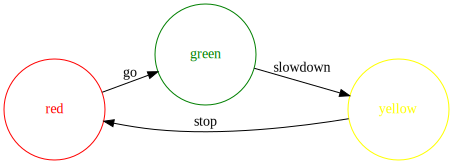
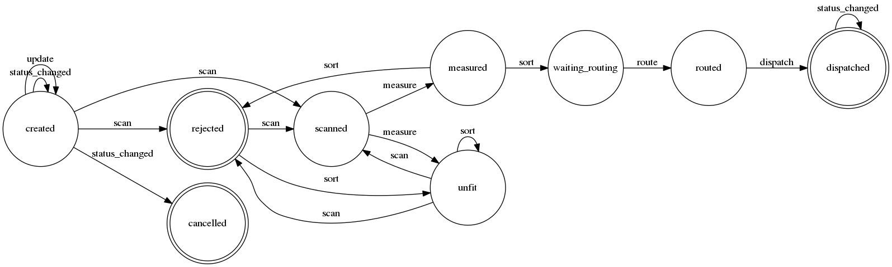

# Máquinas de estado em Python

Vou apresentar um case de máquina de estados aplicada para resolver um problema no mundo real. Depois vamos entender o que deve ser uma máquina de estados na programação cotidiana, dentro do contexto de um sistema, desconstruindo sua origen formal e matemática e construindo um modelo pragmático e aplicável. Vamos identificar sinais de quando uma máquina de estados pode ser sua melhor amiga, e ver alguns exemplos de código de como utilizar 3 das principais libs disponíveis em Python.

## Um caso de uso

Em julho de 2017, com 5 meses de Loggi. Entrei para o time que cuida da vertical de entregas de e-commerce. Quando você faz uma compra que será entregue pela Loggi, nós coletamos os pacotes nos centros de distribuição (CDs) dos nossos parceiros e realizamos as entregas no mesmo dia, ou no dia seguinte.

Com o aumento das entregas, trouxemos um novo sorter da Índia, único no Brasil. O sorter é quase do tamanho de uma quadra de futebol. Tem uma esteira central, uma série de sensores, e várias saídas como escorregadores, acionadas por braços mecânicos.

O desafio era adaptar nosso sistema para integrá-lo com o sorter.

Como o processo está acontecendo no mundo real, a interação do sistema com o sorter possui limites de tempo rígidos, em que trocamos diversas mensagens. O ponto chave é que uma vez que você coloca um pacote na esteira, ele tem os códigos de barra lidos, e em menos de 0,5s temos que dizer qual braço do sorter deve ser acionado.


Por conta da necessidade de baixa latência, nossa solução foi híbrida entre núvem e um sistema on-premisses. Utilizamos uma arquitetura orientada a eventos, em que cada ação sobre um pacote emite um evento que é postado em um cluster Kafka. Temos um cluster local e um na núvem, sincronizados via `kafka-mirror-maker`.

Para processar este volume de eventos, implementamos uma máquina de estados que roda sobre cada um dos pacotes, garantindo estados consistentes.

Voltarei a este exemplo, primeiro vamos definir o que é uma máquina de estados.

## Máquinas de estados

Máquinas de estado tem origem na matemática, e se você buscar por definições formais encontrará uma série de fórmulas, expressões, siglas, como DFA, NFA, GNFA, Moore, Mealy, classificações, etc. É tema de estudo em uma área da computação chamada de automatos finitos.

O ponto chave é que as máquinas de estado que você precisa para a maioria dos casos são diferentes das que existem na teoria da computação. São bem mais simples.

Nossa definição de máquina de estados vem do padrão de projeto comportamental, em que um objeto sempre está em apenas um dos estados possíveis, e existem transições mapeadas entre estes estados. A alteração de estado se dá em resposta a eventos externos.

A resposta para um evento geralmente depende do tipo de evento e do estado interno do sistema, e pode implicar numa transição de estado.

Considere um semáforo:



Cada um dos círculos é um estado, e cada seta é uma transição de estado possível. O nome associado com a seta representa um evento.

### Eventos

Um evento é algo que acontece que afeta o sistema. Pode conter parâmetros que qualificam o evento, como por exemplo um evento de "tecla pressionada", deve conter a informação da tecla associada.

### Estados

Um estado representa um comportamento do sistema, uma condição de execução que reduz o problema de identificar o contexto de execução do sistema para apenas uma única variável, a do próprio estado, ao invés de muitas variáveis, eliminando lógicas condicionais.

Para o domínio da sua aplicação, deve existir um conjunto finito de estados possíveis, daí o nome FSM (Finite State Machines).

### Estados extendidos

Existe uma interpretação em que cada estado representa um conjunto distinto de valores válidos para todas as variáveis. A quantidade de estados seria como uma permutação de todos os valores possíveis para todas as variáveis. Esta interpretação é impraticável em um sistema pois gera uma infinidade de estados. Variáveis são normalmente desassociadas dos estados.

O estado representa um comportamento, e uma mudança numa variável nem sempre implica em mudança de comportamento.

### RTC (Run to completition)

Todos as definições formais assumem que uma máquina de estados completa o processamento de cada evento antes de iniciar o processamento do próximo evento.

## Vencendo a barreira

Máquinas de estado não são difíceis de implementar. Então por que são tão pouco utilizadas?  Quantas vezes você já implementou uma solução baseada em máquina de estados?

Um motivo pode estar associado a não identificação do padrão, por desconhecimento, ou pelo fato de que muitos objetos não nascem com uma especificação completa do seu ciclo de vida, mas o projeto vai evoluindo ao longo do tempo. E então vamos formando “puxadinhos”, como flags e campos de data que controlam o estado.

Ou existe um campo que define estado ou status no seu modelo, mas o controle dos estados é feito manualmente com uma solução customizada, ao ponto de não saber se a complexidade atual é suficiente para cobrir o esforço necessário em utilizar uma máquina de estados de fato.

Podemos considerar também uma curva de resistência e aprendizado necessários para incorporar uma nova ferramenta ao seu portfólio. Será que valerá o esforço? Como justificar a adoção se a solução atual funciona?

## Aplicações

Existe uma aplicação direta e prática em praticamente qualquer aplicação moderna, que provavelmente vai enxugar seu código, deixá-lo mais organizado e menos sujeito a erros.

Pode ser aplicado sempre que existe mudança de comportamento quando um estado interno muda.

É especialmente útil em sistemas orientados a eventos, e pode reduzir drasticamente o número de branches (if/elses) no código. Implementar um sistema orientado a eventos sem uma máquina de estados pode resultar em código excessivamente complexo e difícil de extender.

O processo em si já oferece um ganho, pois elaborar os estados e eventos te auxilia a descobrir casos de uso e comportamentos não previstos. O domínio da aplicação e de seus objetos fica mais claro.

## Identificando o padrão

Tenho certeza que seja qual for a aplicação que você está desenvolvendo agora, existem nela diversos exemplos de máquinas de estado, o problema é que você pode não ter pensado em máquinas de estado na modelagem da sua solução. Será que você consegue reconhecer um padrão em que esta solução é adequada?

Sintomas de que você pode precisar de uma máquina de estados:

- Ter um campo `state` ou status no seu modelo.
- Campos booleanos, como `published`, `paid`, `started`, `finished`.
- Campos de timestamp que permitem nulos, como `published_at`, `paid_at`.

Considerando a natureza da sua aplicação:

- Quando existem muitas operações com verificações condicionais “protegendo” sua execução.
- Aplicações orientadas a eventos.


## Implementações

Vou apresentar em detalhes como utilizar a biblioteca [python-statemachine](https://github.com/fgmacedo/python-statemachine). No entanto, existem diversas outras soluções disponíveis na comunidade Python.

### hand made

- Padrão `State`  (Gang of Four)
- Dicionário com o mapa das transições.

### transitions

- https://github.com/pytransitions/transitions
- Python 2.7+, 3.3+.
- Full featured with some extra bonus.

### automaton

- https://github.com/nazavode/automaton
- Python 3.4+.
- Minimalist.

### python-statemachine

- https://github.com/fgmacedo/python-statemachine
- Python 2.7+, 3.4+.
- Full featured.


## Solucionando o problema do sorter

Máquina de estados (simplificada):



Definimos os estados:

``` python
class PackageStateMachine(StateMachine):
    # States
    created = State('Criado', initial=True)
    scanned = State('Escaneado')
    measured = State('Medido')
    waiting_routing = State('Aguardando roteirização')
    routed = State('Roteirizado')
    dispatched = State('Expedido')
    rejected = State('Rejeitado')
    unfit = State('Fora do perfil')
    cancelled = State('Cancelado')
```

Definimos as transições e os eventos:

``` python
    # transitions
    scan = (
        created.to(scanned, rejected) |
        rejected.to(scanned, rejected) |
        unfit.to(scanned, rejected)
    )
    measure = (
        scanned.to(measured, unfit) |
        rejected.to(rejected)
    )
    sort = (
        measured.to(waiting_routing, rejected) |
        unfit.to(unfit) |
        rejected.to(unfit)
    )
    route = waiting_routing.to(routed)
    dispatch = routed.to(dispatched)
    status_changed = (
        created.to(created, cancelled) |
        dispatched.to(dispatched)
    )
    update = created.to(created) | rejected.to(rejected)
```
